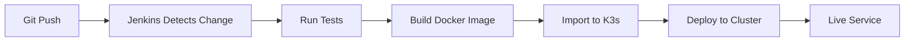

# Atlas Reliability Framework

FastAPI service with PostgreSQL authentication, Ollama LLM integration for book search, deployed on Kubernetes with high availability and monitoring. Includes React frontend for user interaction with Traefik Ingress routing and Jenkins CI/CD automation.

## Architecture

**Backend:**
- **FastAPI** - REST API with clean architecture
- **PostgreSQL** - User authentication database
- **JWT** - Token-based authentication
- **Ollama (gemma3:270m)** - LLM for keyword extraction
- **Google Books API** - Book database search
- **Prometheus** - Metrics collection
- **Kubernetes (K3s)** - Container orchestration with 3 replicas
- **Ansible** - Infrastructure automation

**Frontend:**
- **React 18** - User interface library
- **Nginx** - Static file server
- **React Router** - Client-side routing
- **Axios** - HTTP client for API calls
- **Context API** - Global authentication state
- **Jest & React Testing Library** - Unit testing

**Networking:**
- **Traefik Ingress** - Production-ready routing and load balancing
- **CORS** - Cross-origin resource sharing enabled

**CI/CD:**
- **Jenkins** - Automated testing, building, and deployment
- **Docker** - Container image building
- **Git** - Version control and pipeline triggers

## Project Structure
```
atlas-reliability-framework/
├── backend/                         # Backend (FastAPI)
│   ├── Dockerfile                   # Backend container image
│   ├── pytest.ini                   # Backend test configuration
│   ├── api/routes/
│   ├── core/
│   ├── db/
│   ├── models/
│   ├── services/
│   └── tests/                       # Backend unit tests (pytest)
│       ├── test_auth_routes.py
│       ├── test_auth_service.py
│       ├── test_books.py
│       ├── test_config.py
│       ├── test_google_books_service.py
│       ├── test_health_routes.py
│       ├── test_main.py
│       ├── test_metrics.py
│       ├── test_ollama_service.py
│       ├── test_protected_routes.py
│       └── test_schemas.py
├── frontend/                        # Frontend (React)
│   ├── Dockerfile                   # Frontend container image (nginx)
│   ├── nginx.conf                   # Nginx static file server config
│   ├── public/
│   ├── src/
│   │   ├── pages/
│   │   ├── services/
│   │   ├── context/
│   │   └── __tests__/               # Frontend unit tests (Jest)
│   └── package.json
├── ansible/
│   ├── k8s/
│   │   ├── deployment.yaml              # Backend deployment
│   │   ├── service.yaml                 # Backend service
│   │   ├── frontend-deployment.yaml     # Frontend deployment
│   │   ├── frontend-service.yaml        # Frontend service
│   │   ├── ingress.yaml                 # Traefik Ingress routing
│   │   ├── postgres-secrets.yaml
│   │   ├── postgres-statefulset.yaml
│   │   ├── postgres-service.yaml
│   │   └── db-schema-configmap.yaml
│   └── playbooks/
│       ├── setup-infrastructure.yml
│       ├── setup-postgres.yml
│       ├── deploy-application.yml       # Deploy backend only
│       ├── deploy-frontend.yml          # Deploy frontend only
│       └── deploy-full-stack.yml        # Deploy everything
├── Jenkinsfile-backend              # Backend CI/CD pipeline
├── Jenkinsfile-frontend             # Frontend CI/CD pipeline
├── venv/                            # Python virtual environment (project-wide)
└── README.md
```

## Prerequisites

- Python 3.11+
- Node.js 16+
- Docker
- K3s
- Ansible
- kubectl
- Jenkins (for CI/CD)

## 🔄 CI/CD Pipeline

This project includes automated CI/CD pipelines for both backend and frontend services using Jenkins.

### Pipeline Architecture
```
GitHub Push → Jenkins → Test → Build → Deploy to K3s
```

### Backend Pipeline (`Jenkinsfile-backend`)

**Stages:**
1. **Checkout** - Pull latest code from GitHub
2. **Test Backend** - Run pytest suite (58 tests)
3. **Build Docker Image** - Create containerized backend
4. **Import to K3s** - Load image into Kubernetes cluster
5. **Deploy to K3s** - Deploy via Ansible playbook

**Trigger:** Automatic on push to `master` branch

**Jenkins Job:** `atlas-backend-pipeline`

### Frontend Pipeline (`Jenkinsfile-frontend`)

**Stages:**
1. **Checkout** - Pull latest code from GitHub
2. **Build Docker Image** - Create containerized frontend
3. **Import to K3s** - Load image into Kubernetes cluster
4. **Deploy to K3s** - Deploy via Ansible playbook

**Trigger:** Automatic on push to `master` branch

**Jenkins Job:** `atlas-frontend-pipeline`

### CI/CD Setup Instructions

#### 1. Configure Jenkins Permissions

Allow Jenkins to run K3s commands without password:
```bash
sudo visudo
```

Add the following line:
```
jenkins ALL=(ALL) NOPASSWD: /usr/local/bin/k3s
```

#### 2. Create Backend Pipeline

1. Jenkins → New Item → `atlas-backend-pipeline` → Pipeline
2. Configure:
   - **Definition**: Pipeline script from SCM
   - **SCM**: Git
   - **Repository URL**: `https://github.com/YOUR-USERNAME/Atlas-Reliability-Framework.git`
   - **Branch**: `*/master`
   - **Script Path**: `Jenkinsfile-backend`
3. Save

#### 3. Create Frontend Pipeline

1. Jenkins → New Item → `atlas-frontend-pipeline` → Pipeline
2. Configure:
   - **Definition**: Pipeline script from SCM
   - **SCM**: Git
   - **Repository URL**: `https://github.com/YOUR-USERNAME/Atlas-Reliability-Framework.git`
   - **Branch**: `*/master`
   - **Script Path**: `Jenkinsfile-frontend`
3. Save

#### 4. Trigger Pipelines

**Option 1 - Manual:**
- Click "Build Now" in Jenkins UI

**Option 2 - Automatic (on Git push):**
- Configure GitHub webhook pointing to Jenkins
- Pipelines trigger automatically on code push

### CI/CD Pipeline Flow


## Quick Start

### 1. Setup PostgreSQL
```bash
cd ansible
ansible-playbook playbooks/setup-postgres.yml
```

### 2. Deploy Full Stack (Backend + Frontend)

**Manual Deployment:**
```bash
ansible-playbook playbooks/deploy-full-stack.yml
```

**OR Deploy via CI/CD:**
```bash
# Just push to GitHub - Jenkins handles the rest!
git add .
git commit -m "deploy: update application"
git push origin master
```

**OR Deploy Separately:**
```bash
ansible-playbook playbooks/deploy-application.yml
ansible-playbook playbooks/deploy-frontend.yml
```

### 3. Deploy Ingress
```bash
kubectl apply -f k8s/ingress.yaml
```

### 4. Setup Port Forwarding
```bash
sudo kubectl port-forward -n kube-system service/traefik 80:80 --address 0.0.0.0
```

### 5. Configure Hosts (Optional)

**Windows (PowerShell as Administrator):**
```powershell
Add-Content C:\Windows\System32\drivers\etc\hosts "127.0.0.1 atlas.local"
```

**Linux/Mac:**
```bash
echo "127.0.0.1 atlas.local" | sudo tee -a /etc/hosts
```

### 6. Access Application

- **With hosts file:** http://atlas.local
- **Without hosts file:** http://localhost

### 7. Verify Deployment
```bash
kubectl get pods,svc,ingress

curl http://localhost/health
```

## Services & Ports

| Service | Type | Port | Purpose |
|---------|------|------|---------|
| atlas-frontend | ClusterIP | 80 | React UI (nginx) |
| atlas-service | ClusterIP | 8000 | FastAPI Backend |
| postgres | ClusterIP | 5432 | PostgreSQL Database |
| traefik | LoadBalancer | 80 | Ingress Controller |

## Ingress Routing

Traefik Ingress provides unified access on port 80:

| Path | Backend | Purpose |
|------|---------|---------|
| `/` | atlas-frontend:80 | React application |
| `/api/*` | atlas-service:8000 | Backend API (strips /api prefix) |
| `/health` | atlas-service:8000 | Health check |
| `/metrics` | atlas-service:8000 | Prometheus metrics |

## User Flow

### 1. Access Application
- Open browser: `http://atlas.local` or `http://localhost`
- View landing page with system metrics

### 2. Register
- Click "Register" button
- Create account with username (min 3 chars) and password (min 6 chars)
- Auto-redirect to login

### 3. Login
- Enter credentials
- Receive JWT token (30-minute expiration)
- Auto-redirect to query page

### 4. Search Books
- Enter natural language description (e.g., "action superhero books")
- AI extracts keywords via Ollama LLM
- View results from Google Books API
- See thumbnails, titles, authors, categories, descriptions

### 5. Logout
- Click "Logout" to return to home

## API Endpoints

### Public Endpoints

#### GET /
Landing page

#### GET /health
Health check

#### GET /metrics
Prometheus metrics

#### POST /api/auth/register
Register new user

**Request:**
```json
{
  "username": "string",
  "password": "string"
}
```

#### POST /api/auth/login
Login and receive JWT

**Request:**
```json
{
  "username": "string",
  "password": "string"
}
```

**Response:**
```json
{
  "access_token": "string",
  "token_type": "bearer"
}
```

### Protected Endpoints (Require JWT)

#### POST /api/books/search
Search books

**Headers:**
```
Authorization: Bearer <token>
```

**Request:**
```json
{
  "description": "action superhero books"
}
```

## Database Schema

### Users Table
```sql
CREATE TABLE users (
    id SERIAL PRIMARY KEY,
    username VARCHAR(255) UNIQUE NOT NULL,
    hashed_password VARCHAR(255) NOT NULL,
    created_at TIMESTAMP DEFAULT CURRENT_TIMESTAMP,
    is_active BOOLEAN DEFAULT TRUE
);
```

## Testing

### Backend Tests
```bash
cd backend
pytest tests/ -v
pytest tests/ --cov=backend
```

### Frontend Tests
```bash
cd frontend
npm test
npm test -- --coverage
```

### CI/CD Test Automation
Backend tests run automatically in Jenkins pipeline on every commit.

## Monitoring

### Prometheus Metrics
Available at `http://localhost/metrics`:
- `http_requests_total` - Total HTTP requests
- `http_request_duration_seconds` - Request latency
- `active_requests` - Active requests
- `external_api_calls_total` - External API calls
- `authenticated_requests_total` - Authenticated requests

### Kubernetes Health
```bash
kubectl get pods -w
kubectl logs -f deployment/atlas-frontend
kubectl logs -f deployment/atlas-service
kubectl logs -f -n kube-system deployment/traefik
```

### Jenkins Pipeline Monitoring
- View pipeline status in Jenkins UI
- Check build history and logs
- Monitor deployment success rate

## High Availability

### Application Layer
- **Backend:** 3 replicas (FastAPI + Ollama sidecar)
- **Frontend:** 1 replica (nginx)
- **Ingress:** Traefik with automatic load balancing
- **Automatic restart** on health check failure
- **Init containers** ensure PostgreSQL is ready
- **CI/CD:** Automated testing prevents broken deployments

### Database Layer
- **PostgreSQL StatefulSet** with persistent storage (1Gi)
- **Liveness/Readiness probes**

## Security

- **Passwords:** Hashed with bcrypt
- **JWT Tokens:** HS256, 30-minute expiration
- **CORS:** Enabled for cross-origin requests
- **Kubernetes Secrets** for PostgreSQL credentials
- **Frontend:** Token stored in localStorage
- **Backend:** JWT validation on protected endpoints
- **CI/CD:** Automated testing catches security issues early

## Development

### Backend Local Development
```bash
cd backend
source ../venv/bin/activate
pip install -r requirements.txt
pytest tests/ -v
uvicorn main:app --reload
```

### Frontend Local Development
```bash
cd frontend
npm install
npm start
npm test
npm run build
```

### CI/CD Development Workflow
```bash
# 1. Make changes
git checkout -b feature/my-feature

# 2. Test locally
cd backend && pytest tests/ -v

# 3. Commit and push
git add .
git commit -m "feat: add new feature"
git push origin feature/my-feature

# 4. Merge to master (triggers CI/CD)
git checkout master
git merge feature/my-feature
git push origin master

# 5. Jenkins automatically: tests → builds → deploys
```

## Troubleshooting

### CI/CD Issues

#### Pipeline Fails at Test Stage
```bash
# Check test logs in Jenkins
# Run tests locally to debug
cd backend
pytest tests/ -v --tb=short
```

#### Pipeline Fails at Build Stage
```bash
# Verify Dockerfile syntax
docker build -t test-image ./backend

# Check Docker daemon
sudo systemctl status docker
```

#### Pipeline Fails at Deploy Stage
```bash
# Check Ansible playbook
ansible-playbook playbooks/deploy-application.yml --check

# Verify K3s cluster
kubectl get nodes
kubectl get pods
```

#### Jenkins Can't Import to K3s
```bash
# Verify sudo permissions
sudo visudo
# Ensure: jenkins ALL=(ALL) NOPASSWD: /usr/local/bin/k3s

# Test manually
sudo -u jenkins sudo k3s ctr version
```

### Ingress Issues
```bash
kubectl logs -n kube-system deployment/traefik
kubectl describe ingress atlas-ingress
```

### Backend Issues
```bash
kubectl logs -l app=atlas-service -c atlas-app
kubectl describe deployment atlas-service
```

### Frontend Issues
```bash
kubectl logs -l app=atlas-frontend
kubectl describe deployment atlas-frontend
```

### Database Issues
```bash
kubectl logs postgres-0
kubectl exec -it postgres-0 -- psql -U atlasuser -d atlasdb
```

### Port Forward Not Working
```bash
sudo kubectl port-forward -n kube-system service/traefik 80:80 --address 0.0.0.0
```

### CORS Errors
Verify CORS middleware is enabled in `backend/main.py`:
```python
app.add_middleware(
    CORSMiddleware,
    allow_origins=["*"],
    allow_credentials=True,
    allow_methods=["*"],
    allow_headers=["*"],
)
```

### Rebuild & Redeploy
```bash
# Manual
cd ansible
ansible-playbook playbooks/deploy-full-stack.yml
kubectl apply -f k8s/ingress.yaml

# OR via CI/CD
git commit --allow-empty -m "trigger: redeploy"
git push origin master
```

### Clear Everything
```bash
kubectl delete ingress atlas-ingress
kubectl delete deployment atlas-frontend atlas-service
kubectl delete service atlas-frontend atlas-service
kubectl delete statefulset postgres
kubectl delete pvc postgres-pvc
```

## Production Deployment (AWS EKS)

### Key Differences for AWS

**Ingress Controller:**
- Replace Traefik with AWS ALB Ingress Controller
- Update annotation: `kubernetes.io/ingress.class: alb`

**Service Type:**
- Use `type: LoadBalancer` for automatic ELB provisioning
- Configure target groups and health checks

**Storage:**
- Replace local PVC with AWS EBS volumes
- Use StorageClass: `gp3` or `gp2`

**DNS:**
- Configure Route53 for domain routing
- Use ACM for SSL certificates

**CI/CD:**
- Configure Jenkins with AWS IAM roles
- Use ECR for Docker image registry
- Deploy to EKS cluster instead of K3s

## Color Scheme

- **Navy Blue:** `#1e3a5f` (Headers)
- **Light Blue:** `#5ba3d0` (Buttons, accents)
- **Beige/Tan:** `#e8b67a` (Subtitle)
- **Light Gray:** `#f5f5f5` (Background)

## License

© 2025 Atlas Reliability Framework
