# 📚 Atlas Reliability Framework – AI-Powered Book Discovery Platform


🎯 **Project Purpose**  
Atlas Reliability Framework is an enterprise-grade book discovery platform that combines natural language processing with intelligent search. Using AI-powered keyword extraction via Ollama's Gemma3 model, users can describe books in natural language and receive relevant results from Google Books API — all backed by a highly available, production-ready Kubernetes infrastructure with automated CI/CD pipelines.

---

## 🛠️ Tech Stack

### Backend
- **Framework:** FastAPI (Python 3.11+)
- **Database:** PostgreSQL 14+
- **Authentication:** JWT with bcrypt password hashing
- **AI Engine:** Ollama (Gemma3:270m model)
- **External API:** Google Books API
- **Monitoring:** Prometheus metrics

### Frontend
- **Framework:** React 18
- **Server:** Nginx
- **Routing:** React Router
- **HTTP Client:** Axios
- **State Management:** Context API
- **Testing:** Jest & React Testing Library

### Infrastructure
- **Orchestration:** Kubernetes (K3s)
- **Automation:** Ansible
- **CI/CD:** Jenkins
- **Ingress:** Traefik
- **Containerization:** Docker

---

## 🏗️ Architecture Overview

```mermaid
graph TB
    subgraph "User Layer"
        Browser[🌐 Web Browser]
    end
    
    subgraph "Ingress Layer"
        Traefik[⚡ Traefik Ingress<br/>Port 80]
    end
    
    subgraph "Application Layer"
        Frontend[⚛️ React Frontend<br/>nginx:80]
        Backend1[🚀 FastAPI Pod 1<br/>+Ollama Sidecar]
        Backend2[🚀 FastAPI Pod 2<br/>+Ollama Sidecar]
        Backend3[🚀 FastAPI Pod 3<br/>+Ollama Sidecar]
    end
    
    subgraph "Data Layer"
        PostgreSQL[(🗄️ PostgreSQL<br/>StatefulSet)]
        GoogleBooks[📚 Google Books API]
    end
    
    subgraph "Monitoring"
        Prometheus[📊 Prometheus]
    end
    
    Browser -->|http://atlas.local| Traefik
    Traefik -->|/| Frontend
    Traefik -->|/api/*| Backend1 & Backend2 & Backend3
    Backend1 & Backend2 & Backend3 -->|Auth Queries| PostgreSQL
    Backend1 & Backend2 & Backend3 -->|Book Search| GoogleBooks
    Backend1 & Backend2 & Backend3 -->|Metrics| Prometheus
    
    style Traefik fill:#5ba3d0
    style Frontend fill:#61dafb
    style Backend1 fill:#009688
    style Backend2 fill:#009688
    style Backend3 fill:#009688
    style PostgreSQL fill:#336791
    style Prometheus fill:#E6522C
```



---

## ✅ Features

### Core Functionality
- 🟢 **AI-Powered Search** - Natural language book queries via Ollama Gemma3
- 🟢 **Secure Authentication** - JWT-based user system with PostgreSQL
- 🟢 **Real-time Results** - Direct integration with Google Books API
- 🟢 **Responsive UI** - Modern React interface with mobile support

### Infrastructure & DevOps
- 🟢 **High Availability** - 3 backend replicas with automatic load balancing
- 🟢 **CI/CD Automation** - Jenkins pipelines for testing, building, and deployment
- 🟢 **Production-Ready** - Kubernetes deployment with health checks and auto-restart
- 🟢 **Monitoring** - Prometheus metrics and comprehensive logging
- 🟢 **Scalable Architecture** - Microservices design with container orchestration

### Developer Experience
- 🟢 **Comprehensive Testing** - 58 backend tests with 92% coverage
- 🟢 **Clean Code** - Modular architecture with separation of concerns
- 🟢 **Documentation** - Detailed API docs and setup guides
- 🟢 **Infrastructure as Code** - Ansible playbooks for reproducible deployments

---

## 📸 Screenshots

### Landing Page

*Clean, modern interface with system metrics and call-to-action*

### User Registration

*Secure account creation with validation*

### Login Interface

*JWT-based authentication with 30-minute token expiration*

### Book Search

*AI-powered natural language search with real-time results*

### Search Results

*Rich book information including thumbnails, authors, and descriptions*

---

## 🚀 Quick Start Guide

### Prerequisites Verification

Ensure the following are installed and running:
- Python 3.11+
- Node.js 16+
- Docker & Docker Compose
- K3s (Kubernetes)
- Ansible
- kubectl
- Jenkins (for CI/CD)
- Git

### Step 1: Clone Repository

```bash
git clone https://github.com/YOUR-USERNAME/Atlas-Reliability-Framework.git
cd Atlas-Reliability-Framework
```

### Step 2: Environment Setup

Create Python virtual environment:

```bash
python3.11 -m venv venv
source venv/bin/activate  # Linux/Mac
# OR
venv\Scripts\activate  # Windows
```

Install backend dependencies:

```bash
cd backend
pip install -r requirements.txt
```

Install frontend dependencies:

```bash
cd ../frontend
npm install
```

### Step 3: Infrastructure Setup

Deploy PostgreSQL database:

```bash
cd ../ansible
ansible-playbook playbooks/setup-infrastructure.yml
ansible-playbook playbooks/setup-postgres.yml
```

### Step 4: Deploy Application

**Option A: Manual Deployment**
```bash
ansible-playbook playbooks/deploy-full-stack.yml
kubectl apply -f k8s/ingress.yaml
```

**Option B: CI/CD Deployment**
```bash
# Configure Jenkins pipelines (see CI/CD section)
# Then simply push to master:
git add .
git commit -m "deploy: initial deployment"
git push origin master
```

### Step 5: Configure Networking

Setup port forwarding:

```bash
sudo kubectl port-forward -n kube-system service/traefik 80:80 --address 0.0.0.0
```

Configure hosts file (optional):

**Windows (PowerShell as Administrator):**
```powershell
Add-Content C:\Windows\System32\drivers\etc\hosts "127.0.0.1 atlas.local"
```

**Linux/Mac:**
```bash
echo "127.0.0.1 atlas.local" | sudo tee -a /etc/hosts
```

### Step 6: Access the Application

- **With hosts file:** http://atlas.local
- **Without hosts file:** http://localhost
- **API Docs:** http://localhost/docs
- **Health Check:** http://localhost/health
- **Metrics:** http://localhost/metrics

### Step 7: Verify Deployment

```bash
# Check all pods are running
kubectl get pods,svc,ingress

# Verify backend health
curl http://localhost/health

# Check metrics endpoint
curl http://localhost/metrics
```

---

## 🔄 CI/CD Pipeline Architecture

Atlas includes enterprise-grade automated pipelines for continuous integration and deployment.

### Pipeline Flow

```mermaid
graph LR
    A[📝 Git Push] --> B[🔔 Jenkins Webhook]
    B --> C[🧪 Run Tests]
    C --> D{✅ Tests Pass?}
    D -->|Yes| E[🏗️ Build Docker Image]
    D -->|No| F[❌ Fail Pipeline]
    E --> G[📦 Import to K3s]
    G --> H[🚀 Deploy to Cluster]
    H --> I[✅ Live Service]
    
    style A fill:#f9f9f9
    style C fill:#FFA500
    style E fill:#5ba3d0
    style H fill:#009688
    style I fill:#4CAF50
    style F fill:#f44336
```



### Backend Pipeline

**Jenkinsfile:** `Jenkinsfile-backend`

**Stages:**
1. **Checkout** - Clone latest code from GitHub
2. **Test Backend** - Execute pytest suite (58 tests, 92% coverage)
3. **Build Docker Image** - Containerize FastAPI application
4. **Import to K3s** - Load image into cluster registry
5. **Deploy to K3s** - Apply Ansible deployment playbook

**Trigger:** Automatic on push to `master` branch

**Job Name:** `atlas-backend-pipeline`

### Frontend Pipeline

**Jenkinsfile:** `Jenkinsfile-frontend`

**Stages:**
1. **Checkout** - Clone latest code from GitHub
2. **Build Docker Image** - Containerize React application
3. **Import to K3s** - Load image into cluster registry
4. **Deploy to K3s** - Apply Ansible deployment playbook

**Trigger:** Automatic on push to `master` branch

**Job Name:** `atlas-frontend-pipeline`

### Setting Up CI/CD

#### 1. Configure Jenkins Permissions

```bash
sudo visudo
```

Add the following line:
```
jenkins ALL=(ALL) NOPASSWD: /usr/local/bin/k3s
```

#### 2. Create Backend Pipeline

1. Jenkins → New Item → `atlas-backend-pipeline` → Pipeline
2. Configure:
   - **Definition:** Pipeline script from SCM
   - **SCM:** Git
   - **Repository URL:** `https://github.com/YOUR-USERNAME/Atlas-Reliability-Framework.git`
   - **Branch:** `*/master`
   - **Script Path:** `Jenkinsfile-backend`
3. Save

#### 3. Create Frontend Pipeline

1. Jenkins → New Item → `atlas-frontend-pipeline` → Pipeline
2. Configure:
   - **Definition:** Pipeline script from SCM
   - **SCM:** Git
   - **Repository URL:** `https://github.com/YOUR-USERNAME/Atlas-Reliability-Framework.git`
   - **Branch:** `*/master`
   - **Script Path:** `Jenkinsfile-frontend`
3. Save

#### 4. Development Workflow

```bash
# 1. Create feature branch
git checkout -b feature/my-feature

# 2. Make changes and test locally
cd backend && pytest tests/ -v

# 3. Commit and push
git add .
git commit -m "feat: add new feature"
git push origin feature/my-feature

# 4. Merge to master (triggers CI/CD)
git checkout master
git merge feature/my-feature
git push origin master

# 5. Jenkins automatically: tests → builds → deploys
```

---

## 🧪 Testing and Validation

### Backend Testing

```bash
cd backend
source ../venv/bin/activate

# Run all tests
pytest tests/ -v

# Run with coverage
pytest tests/ --cov=backend --cov-report=html

# Run specific test file
pytest tests/test_auth_routes.py -v
```

**Test Coverage:**
```
test_auth_routes.py ............... 12 passed
test_auth_service.py .............. 8 passed
test_books.py ..................... 6 passed
test_config.py .................... 3 passed
test_google_books_service.py ...... 5 passed
test_health_routes.py ............. 4 passed
test_main.py ...................... 7 passed
test_metrics.py ................... 5 passed
test_ollama_service.py ............ 4 passed
test_protected_routes.py .......... 3 passed
test_schemas.py ................... 1 passed

Total: 58 tests passed
Coverage: 92%
```

### Frontend Testing

```bash
cd frontend

# Run all tests
npm test

# Run with coverage
npm test -- --coverage

# Run in watch mode
npm test -- --watch
```

### CI/CD Testing

Tests run automatically in Jenkins pipeline on every commit. View results in Jenkins UI:
- Build history
- Test reports
- Coverage metrics
- Deployment logs

---

## 📡 API Reference

### Public Endpoints

#### `GET /`
Landing page with system information

**Response:**
```json
{
  "service": "Atlas Reliability Framework",
  "version": "1.0.0",
  "status": "operational"
}
```

#### `GET /health`
Health check endpoint for monitoring

**Response:**
```json
{
  "status": "healthy",
  "database": "connected",
  "ollama": "ready"
}
```

#### `GET /metrics`
Prometheus metrics endpoint

**Metrics:**
- `http_requests_total` - Total HTTP requests
- `http_request_duration_seconds` - Request latency
- `active_requests` - Active requests
- `external_api_calls_total` - External API calls
- `authenticated_requests_total` - Authenticated requests

#### `POST /api/auth/register`
Create new user account

**Request:**
```json
{
  "username": "john_doe",
  "password": "SecurePass123!"
}
```

**Response:**
```json
{
  "message": "User registered successfully",
  "username": "john_doe"
}
```

**Validation:**
- Username: minimum 3 characters
- Password: minimum 6 characters

#### `POST /api/auth/login`
Authenticate user and receive JWT token

**Request:**
```json
{
  "username": "john_doe",
  "password": "SecurePass123!"
}
```

**Response:**
```json
{
  "access_token": "eyJhbGciOiJIUzI1NiIsInR5cCI6IkpXVCJ9...",
  "token_type": "bearer"
}
```

**Token Details:**
- Algorithm: HS256
- Expiration: 30 minutes
- Type: Bearer

### Protected Endpoints

**Authentication Required:** All protected endpoints require JWT token in Authorization header:

```
Authorization: Bearer <your_jwt_token>
```

#### `POST /api/books/search`
Search books using natural language

**Request:**
```json
{
  "description": "action superhero books with complex plots"
}
```

**Response:**
```json
{
  "query": "action superhero books with complex plots",
  "keywords": ["action", "superhero", "complex", "plots"],
  "books": [
    {
      "title": "Watchmen",
      "authors": ["Alan Moore", "Dave Gibbons"],
      "description": "A complex superhero narrative...",
      "thumbnail": "http://books.google.com/...",
      "categories": ["Comics & Graphic Novels"],
      "publishedDate": "1987"
    }
  ]
}
```

---

## 🗄️ Database Schema

### Users Table

```sql
CREATE TABLE users (
    id SERIAL PRIMARY KEY,
    username VARCHAR(255) UNIQUE NOT NULL,
    hashed_password VARCHAR(255) NOT NULL,
    created_at TIMESTAMP DEFAULT CURRENT_TIMESTAMP,
    is_active BOOLEAN DEFAULT TRUE
);
```

**Indexes:**
- Primary key on `id`
- Unique index on `username`

**Security:**
- Passwords hashed with bcrypt (cost factor: 12)
- No plain-text password storage
- Automatic timestamp tracking

---

## 📊 Monitoring and Observability

### Prometheus Metrics

Access metrics at `http://localhost/metrics`

**Available Metrics:**

| Metric | Type | Description |
|--------|------|-------------|
| `http_requests_total` | Counter | Total HTTP requests by endpoint and method |
| `http_request_duration_seconds` | Histogram | Request latency distribution |
| `active_requests` | Gauge | Current active requests |
| `external_api_calls_total` | Counter | Calls to Google Books API and Ollama |
| `authenticated_requests_total` | Counter | Authenticated vs. unauthenticated requests |

### Kubernetes Health Monitoring

```bash
# Watch pod status
kubectl get pods -w

# Check frontend logs
kubectl logs -f deployment/atlas-frontend

# Check backend logs
kubectl logs -f deployment/atlas-service

# Check Traefik ingress logs
kubectl logs -f -n kube-system deployment/traefik

# View pod details
kubectl describe pod <pod-name>
```

### Jenkins Pipeline Monitoring

- **Build History:** Track deployment frequency
- **Test Reports:** Monitor test success rate
- **Build Logs:** Debug failed deployments
- **Metrics:** View pipeline execution time

---

## 🔒 Security Features

### Authentication & Authorization
- **Password Security:** Bcrypt hashing with salt
- **JWT Tokens:** HS256 algorithm, 30-minute expiration
- **Token Storage:** localStorage (frontend), secure HTTP-only recommended for production
- **Protected Routes:** Middleware validation on all protected endpoints

### Infrastructure Security
- **Secrets Management:** Kubernetes Secrets for PostgreSQL credentials
- **Network Policies:** ClusterIP services for internal communication
- **CORS Configuration:** Configured for cross-origin requests
- **SQL Injection Prevention:** Parameterized queries via SQLAlchemy

### CI/CD Security
- **Automated Testing:** Security issues caught before deployment
- **Access Control:** Jenkins permissions for K3s commands
- **Container Scanning:** Docker image vulnerability checks (recommended)
- **Secret Management:** Environment variables via Kubernetes Secrets

---

## 🏗️ High Availability Architecture

### Application Layer
- **Backend Replicas:** 3 pods with automatic load balancing
- **Frontend Replicas:** 1 pod (scalable to multiple)
- **Ingress Controller:** Traefik with health-based routing
- **Health Checks:** Liveness and readiness probes
- **Auto-Restart:** Kubernetes self-healing on failures
- **Init Containers:** Ensure PostgreSQL is ready before startup

### Database Layer
- **PostgreSQL StatefulSet:** Persistent storage with 1Gi volume
- **Health Probes:** Liveness and readiness checks
- **Backup Strategy:** Scheduled backups (recommended for production)

### Load Balancing
- **Traefik Ingress:** Distributes traffic across backend replicas
- **Service Discovery:** Kubernetes DNS for service resolution
- **Session Affinity:** Configurable for stateful requirements

---

## 📁 Project Structure

```
atlas-reliability-framework/
├── backend/                         # Backend (FastAPI)
│   ├── Dockerfile                   # Backend container image
│   ├── requirements.txt             # Python dependencies
│   ├── pytest.ini                   # Test configuration
│   ├── main.py                      # Application entry point
│   ├── api/
│   │   └── routes/                  # API route handlers
│   │       ├── auth.py              # Authentication endpoints
│   │       ├── books.py             # Book search endpoints
│   │       ├── health.py            # Health check endpoints
│   │       └── protected.py         # Protected route examples
│   ├── core/
│   │   ├── config.py                # Application configuration
│   │   ├── security.py              # JWT and password utilities
│   │   └── metrics.py               # Prometheus metrics setup
│   ├── db/
│   │   ├── database.py              # Database connection
│   │   └── models.py                # SQLAlchemy models
│   ├── services/
│   │   ├── auth_service.py          # Authentication logic
│   │   ├── google_books_service.py  # Google Books API client
│   │   └── ollama_service.py        # Ollama LLM integration
│   └── tests/                       # Backend unit tests (pytest)
│       ├── test_auth_routes.py      # Auth endpoint tests
│       ├── test_auth_service.py     # Auth service tests
│       ├── test_books.py            # Book search tests
│       ├── test_config.py           # Configuration tests
│       ├── test_google_books_service.py
│       ├── test_health_routes.py
│       ├── test_main.py
│       ├── test_metrics.py
│       ├── test_ollama_service.py
│       ├── test_protected_routes.py
│       └── test_schemas.py
│
├── frontend/                        # Frontend (React)
│   ├── Dockerfile                   # Frontend container (nginx)
│   ├── nginx.conf                   # Nginx configuration
│   ├── package.json                 # npm dependencies
│   ├── public/                      # Static assets
│   ├── src/
│   │   ├── App.js                   # Main application component
│   │   ├── pages/
│   │   │   ├── Home.js              # Landing page
│   │   │   ├── Login.js             # Login page
│   │   │   ├── Register.js          # Registration page
│   │   │   └── Query.js             # Book search page
│   │   ├── services/
│   │   │   └── api.js               # API client (Axios)
│   │   ├── context/
│   │   │   └── AuthContext.js       # Authentication state
│   │   └── __tests__/               # Frontend tests (Jest)
│   └── build/                       # Production build output
│
├── ansible/                         # Infrastructure automation
│   ├── k8s/                         # Kubernetes manifests
│   │   ├── deployment.yaml          # Backend deployment (3 replicas)
│   │   ├── service.yaml             # Backend service
│   │   ├── frontend-deployment.yaml # Frontend deployment
│   │   ├── frontend-service.yaml    # Frontend service
│   │   ├── ingress.yaml             # Traefik Ingress routing
│   │   ├── postgres-secrets.yaml    # Database credentials
│   │   ├── postgres-statefulset.yaml # PostgreSQL StatefulSet
│   │   ├── postgres-service.yaml    # Database service
│   │   └── db-schema-configmap.yaml # Database initialization
│   └── playbooks/                   # Ansible automation
│       ├── setup-infrastructure.yml # Infrastructure setup
│       ├── setup-postgres.yml       # Database deployment
│       ├── deploy-application.yml   # Backend deployment
│       ├── deploy-frontend.yml      # Frontend deployment
│       └── deploy-full-stack.yml    # Full stack deployment
│
├── assets/                          # Documentation assets
│   ├── logo.png                     # Project logo
│   └── screenshots/                 # Application screenshots
│       ├── home.png
│       ├── register.png
│       ├── login.png
│       ├── search.png
│       └── results.png
│
├── Jenkinsfile-backend              # Backend CI/CD pipeline
├── Jenkinsfile-frontend             # Frontend CI/CD pipeline
├── venv/                            # Python virtual environment
├── README.md                        # This file
└── .gitignore                       # Git ignore rules
```

---

## 🚢 Services & Port Configuration

| Service | Type | Internal Port | External Port | Purpose |
|---------|------|---------------|---------------|---------|
| atlas-frontend | ClusterIP | 80 | - | React UI served by nginx |
| atlas-service | ClusterIP | 8000 | - | FastAPI backend API |
| postgres | ClusterIP | 5432 | - | PostgreSQL database |
| traefik | LoadBalancer | 80 | 80 | Ingress controller |

### Ingress Routing Table

| Path | Backend Service | Port | Purpose |
|------|----------------|------|---------|
| `/` | atlas-frontend | 80 | React application root |
| `/api/*` | atlas-service | 8000 | Backend API (prefix stripped) |
| `/health` | atlas-service | 8000 | Health check endpoint |
| `/metrics` | atlas-service | 8000 | Prometheus metrics |
| `/docs` | atlas-service | 8000 | Interactive API documentation |

---

## 👤 User Flow Guide

### 1. Access Application
- Navigate to `http://atlas.local` or `http://localhost`
- View landing page with:
  - System status indicators
  - Service metrics
  - Quick start guide
  - Login/Register options

### 2. Create Account
- Click **"Register"** button
- Enter credentials:
  - **Username:** Minimum 3 characters, alphanumeric
  - **Password:** Minimum 6 characters, mix of letters and numbers recommended
- Submit form
- **Automatic redirect** to login page on success

### 3. Sign In
- Enter registered credentials
- Click **"Login"**
- Receive JWT token (30-minute validity)
- **Automatic redirect** to book search page
- Token stored in localStorage for session persistence

### 4. Search Books
- Enter natural language description:
  - Example: *"science fiction books about space exploration"*
  - Example: *"mystery thriller with detective protagonist"*
  - Example: *"historical fiction about World War II"*
- AI extracts keywords using Ollama Gemma3 LLM
- Results display from Google Books API:
  - Book thumbnails
  - Titles and authors
  - Publication dates
  - Categories/genres
  - Detailed descriptions
  - Publisher information

### 5. View Results
- Browse through search results
- View book details
- Click thumbnails for larger images
- Read full descriptions

### 6. Logout
- Click **"Logout"** button in navigation
- Token cleared from localStorage
- Redirect to landing page
- Session ended securely

---

## 🔧 Development Guide

### Local Backend Development

```bash
# Activate virtual environment
cd backend
source ../venv/bin/activate

# Install dependencies
pip install -r requirements.txt

# Run development server
uvicorn main:app --reload --host 0.0.0.0 --port 8000

# Run tests
pytest tests/ -v

# Run with coverage
pytest tests/ --cov=backend --cov-report=html
```

### Local Frontend Development

```bash
cd frontend

# Install dependencies
npm install

# Start development server
npm start

# Run tests
npm test

# Build for production
npm run build

# Run tests with coverage
npm test -- --coverage
```

### Testing Workflow

```bash
# Backend testing
cd backend
pytest tests/test_auth_routes.py -v         # Specific test file
pytest tests/ -v -k "test_login"            # Specific test name pattern
pytest tests/ -v --tb=short                 # Short traceback format
pytest tests/ --cov=backend --cov-report=term-missing  # Missing coverage lines

# Frontend testing
cd frontend
npm test -- --coverage --watchAll=false     # Single run with coverage
npm test -- Login.test.js                   # Specific test file
npm test -- --verbose                       # Verbose output
```

---

## 🐛 Troubleshooting Guide

### CI/CD Pipeline Issues

#### Pipeline Fails at Test Stage

```bash
# Check Jenkins console output
# Look for test failure details

# Run tests locally to debug
cd backend
pytest tests/ -v --tb=short

# Check specific failing test
pytest tests/test_auth_routes.py::test_login -vv

# Verify test environment
pytest tests/ --setup-show
```

#### Pipeline Fails at Build Stage

```bash
# Verify Dockerfile syntax
docker build -t atlas-backend:test ./backend
docker build -t atlas-frontend:test ./frontend

# Check Docker daemon status
sudo systemctl status docker

# View Docker logs
sudo journalctl -u docker -n 50

# Clean Docker cache
docker system prune -af
```

#### Pipeline Fails at Deploy Stage

```bash
# Test Ansible playbook syntax
ansible-playbook playbooks/deploy-application.yml --syntax-check

# Run playbook in check mode
ansible-playbook playbooks/deploy-application.yml --check

# Verify Kubernetes cluster
kubectl get nodes
kubectl cluster-info

# Check pod status
kubectl get pods -A

# View deployment status
kubectl describe deployment atlas-service
```

#### Jenkins Cannot Import to K3s

```bash
# Verify sudo permissions
sudo visudo
# Ensure line exists: jenkins ALL=(ALL) NOPASSWD: /usr/local/bin/k3s

# Test manually as jenkins user
sudo -u jenkins sudo k3s ctr version

# Check K3s service status
sudo systemctl status k3s

# View K3s logs
sudo journalctl -u k3s -n 100
```

### Application Issues

#### Backend Pod Not Starting

```bash
# Check pod status
kubectl get pods

# View pod logs
kubectl logs -l app=atlas-service -c atlas-app

# Check init container logs
kubectl logs -l app=atlas-service -c init-db

# Describe pod for events
kubectl describe pod <pod-name>

# Check resource constraints
kubectl top pods
```

#### Frontend Not Loading

```bash
# Check frontend pod status
kubectl get pods -l app=atlas-frontend

# View nginx logs
kubectl logs -l app=atlas-frontend

# Check nginx configuration
kubectl exec -it deployment/atlas-frontend -- cat /etc/nginx/nginx.conf

# Test nginx configuration
kubectl exec -it deployment/atlas-frontend -- nginx -t
```

#### Database Connection Issues

```bash
# Check PostgreSQL pod
kubectl get pods postgres-0

# View database logs
kubectl logs postgres-0

# Test database connection
kubectl exec -it postgres-0 -- psql -U atlasuser -d atlasdb

# Verify database schema
kubectl exec -it postgres-0 -- psql -U atlasuser -d atlasdb -c "\dt"

# Check database credentials in secrets
kubectl get secret postgres-secret -o yaml
```

#### Ingress Not Routing

```bash
# Check Traefik status
kubectl get pods -n kube-system -l app.kubernetes.io/name=traefik

# View Traefik logs
kubectl logs -n kube-system deployment/traefik

# Describe ingress
kubectl describe ingress atlas-ingress

# Check ingress rules
kubectl get ingress atlas-ingress -o yaml

# Verify Traefik service
kubectl get svc -n kube-system traefik
```

#### Port Forward Issues

```bash
# Kill existing port-forward
sudo pkill -f "port-forward"

# Restart port-forward
sudo kubectl port-forward -n kube-system service/traefik 80:80 --address 0.0.0.0

# Check if port 80 is in use
sudo lsof -i :80
sudo netstat -tulpn | grep :80

# Use alternative port
sudo kubectl port-forward -n kube-system service/traefik 8080:80 --address 0.0.0.0
```

#### CORS Errors

Verify CORS middleware in `backend/main.py`:

```python
from fastapi.middleware.cors import CORSMiddleware

app.add_middleware(
    CORSMiddleware,
    allow_origins=["*"],  # Configure for production
    allow_credentials=True,
    allow_methods=["*"],
    allow_headers=["*"],
)
```

For production, replace `["*"]` with specific origins:
```python
allow_origins=["https://atlas.yourdomain.com"]
```

#### Authentication Issues

```bash
# Test registration endpoint
curl -X POST http://localhost/api/auth/register \
  -H "Content-Type: application/json" \
  -d '{"username":"testuser","password":"testpass123"}'

# Test login endpoint
curl -X POST http://localhost/api/auth/login \
  -H "Content-Type: application/json" \
  -d '{"username":"testuser","password":"testpass123"}'

# Test protected endpoint with token
curl -X POST http://localhost/api/books/search \
  -H "Authorization: Bearer YOUR_TOKEN_HERE" \
  -H "Content-Type: application/json" \
  -d '{"description":"science fiction"}'
```

### Complete Reset & Redeploy

```bash
# Delete all resources
kubectl delete ingress atlas-ingress
kubectl delete deployment atlas-frontend atlas-service
kubectl delete service atlas-frontend atlas-service
kubectl delete statefulset postgres
kubectl delete pvc postgres-pvc
kubectl delete secret postgres-secret

# Clean Docker images (optional)
docker system prune -af

# Redeploy infrastructure
cd ansible
ansible-playbook playbooks/setup-infrastructure.yml
ansible-playbook playbooks/setup-postgres.yml

# Deploy application
ansible-playbook playbooks/deploy-full-stack.yml
kubectl apply -f k8s/ingress.yaml

# Setup port forwarding
sudo kubectl port-forward -n kube-system service/traefik 80:80 --address 0.0.0.0
```

---

## 🤝 Contributing

We welcome contributions to the Atlas Reliability Framework! Here's how you can help:

### Development Process

1. **Fork the repository**
2. **Create a feature branch**
   ```bash
   git checkout -b feature/amazing-feature
   ```
3. **Make your changes**
4. **Run tests**
   ```bash
   cd backend && pytest tests/ -v
   cd frontend && npm test
   ```
5. **Commit your changes**
   ```bash
   git commit -m "feat: add amazing feature"
   ```
6. **Push to your fork**
   ```bash
   git push origin feature/amazing-feature
   ```
7. **Open a Pull Request**

### Commit Message Convention

Follow [Conventional Commits](https://www.conventionalcommits.org/):

- `feat:` New feature
- `fix:` Bug fix
- `docs:` Documentation changes
- `style:` Code style changes (formatting)
- `refactor:` Code refactoring
- `test:` Adding or updating tests
- `chore:` Maintenance tasks

### Code Quality Standards

- Python code follows PEP 8
- JavaScript code follows ESLint rules
- All tests must pass before merging
- Code coverage should not decrease
- Documentation must be updated for new features

---

## 📄 License

MIT License

Copyright (c) 2025 Atlas Reliability Framework

Permission is hereby granted, free of charge, to any person obtaining a copy
of this software and associated documentation files (the "Software"), to deal
in the Software without restriction, including without limitation the rights
to use, copy, modify, merge, publish, distribute, sublicense, and/or sell
copies of the Software, and to permit persons to whom the Software is
furnished to do so, subject to the following conditions:

The above copyright notice and this permission notice shall be included in all
copies or substantial portions of the Software.

THE SOFTWARE IS PROVIDED "AS IS", WITHOUT WARRANTY OF ANY KIND, EXPRESS OR
IMPLIED, INCLUDING BUT NOT LIMITED TO THE WARRANTIES OF MERCHANTABILITY,
FITNESS FOR A PARTICULAR PURPOSE AND NONINFRINGEMENT. IN NO EVENT SHALL THE
AUTHORS OR COPYRIGHT HOLDERS BE LIABLE FOR ANY CLAIM, DAMAGES OR OTHER
LIABILITY, WHETHER IN AN ACTION OF CONTRACT, TORT OR OTHERWISE, ARISING FROM,
OUT OF OR IN CONNECTION WITH THE SOFTWARE OR THE USE OR OTHER DEALINGS IN THE
SOFTWARE.
